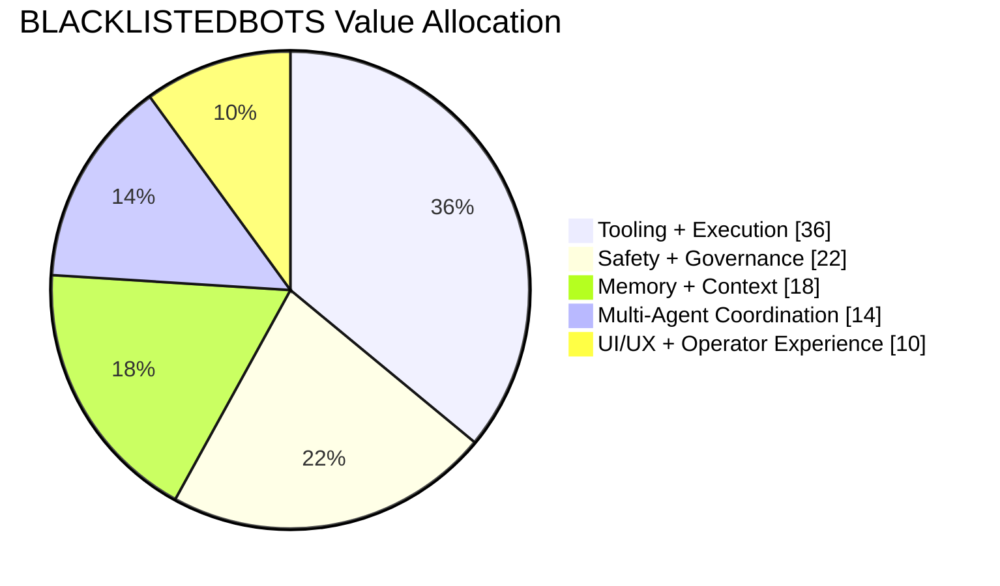
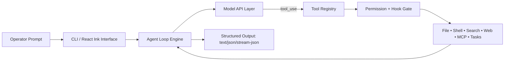
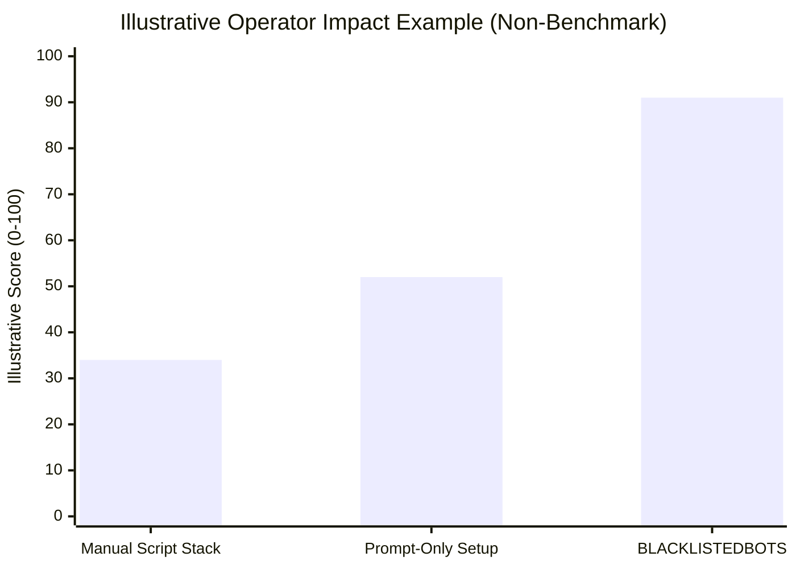
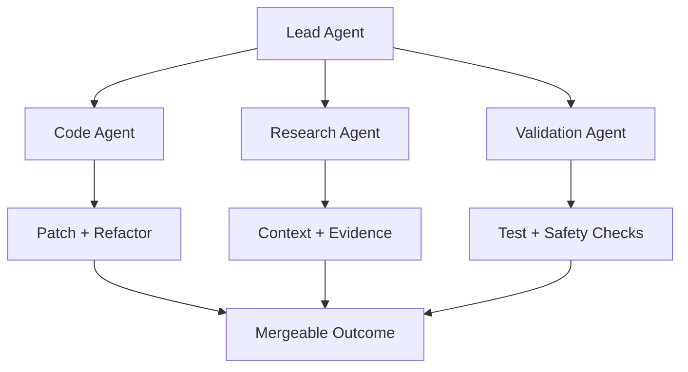

<h1 align="center">
  
  <br/>
  <span>BLACKLISTEDBOTS</span>
</h1>

<p align="center"><strong>By The Blacklisted Binary Labs</strong> · Offensive aesthetics, defensive engineering, zero corporate beige.</p>

<p align="center">
  <a href="README.md"><strong>English</strong></a> ·
  <a href="README.zh-CN.md"><strong>简体中文</strong></a>
</p>

<p align="center">
  
  
  
  
  
  
</p>

---

## ⚡ Welcome to the Blacklist

**BLACKLISTEDBOTS** is a high-voltage, open-source agent harness platform engineered by **The Blacklisted Binary Labs** to make AI agents feel less like polite chat windows and more like elite command units.

It is stylish, sharp, brutally practical, and mildly disrespectful toward boring software.

If your current AI workflow still feels like “copy-paste and pray,” this README is your intervention.

---

## 🧨 Brand Manifesto (Satirical Edition)

> We don’t ship “assistants.”
> We ship programmable co-conspirators with tool belts, memory, permissions, and a suspicious amount of confidence.

### Core vibe

- **Dark hacker aesthetic**: clean black-glass visuals, vivid signal colors, zero fluff.
- **Satirical operator tone**: serious architecture, unserious ego.
- **Marketing-grade presentation**: polished structure, visual hierarchy, conversion-ready clarity.
- **Builder-first substance**: underneath the style is a real, inspectable, extensible system.

---

## 🛰️ Product Positioning Snapshot

| Category | BLACKLISTEDBOTS stance |
|---|---|
| Identity | Open agent harness with operator-grade workflows |
| Personality | The Blacklisted Binary Labs persona: dark, witty, precise |
| Differentiator | Tool execution + memory + permissions + multi-agent orchestration |
| Audience | Builders, researchers, automators, workflow architects |
| Promise | Faster execution, safer operations, cleaner extensibility |

---

## 📊 Feature Dominance Chart



---

## 🧠 The System, in One Glance



---

## 🏴‍☠️ Why Teams Switch to BLACKLISTEDBOTS

### 1) It actually does work, not theater
- Streaming loop with real tool calls
- Built-in retries and structured execution
- Parallel tool workflows where it matters

### 2) It stays governable under pressure
- Permission modes for controlled execution
- Path-level and command-level restrictions
- Lifecycle hooks for policy enforcement

### 3) It remembers context like a professional
- Config + memory continuity across sessions
- Resume-ready sessions and persistent state
- Knowledge loading through skills and plugins

### 4) It scales from solo dev to swarm operations
- Subagent delegation and coordination primitives
- Task lifecycle controls for background execution
- Workflow portability across providers

---

## 🧪 Capability Matrix

| Domain | Highlights |
|---|---|
| Agent Loop | Streamed responses, tool-call cycles, robust control flow |
| Tooling | 43+ tools across file, shell, search, web, MCP, tasking |
| Memory | Persistent memory with session continuity |
| Governance | Permission modes, path rules, command restrictions |
| Extensibility | Skills + plugins + provider workflows |
| UX | React/Ink terminal UI with interactive controls |

---

## 📈 Operator Performance Narrative

_Illustrative example chart only — values are not benchmark measurements._



_This is an illustrative marketing visualization, not a formal benchmark study._

> Translation: less ceremony, more shipped output.

---

## 🧷 Branding Block (Custom Graphic Style)

```text
██████╗ ██╗      █████╗  ██████╗██╗  ██╗██╗     ██╗███████╗████████╗███████╗██████╗
██╔══██╗██║     ██╔══██╗██╔════╝██║ ██╔╝██║     ██║██╔════╝╚══██╔══╝██╔════╝██╔══██╗
██████╔╝██║     ███████║██║     █████╔╝ ██║     ██║███████╗   ██║   █████╗  ██║  ██║
██╔══██╗██║     ██╔══██║██║     ██╔═██╗ ██║     ██║╚════██║   ██║   ██╔══╝  ██║  ██║
██████╔╝███████╗██║  ██║╚██████╗██║  ██╗███████╗██║███████║   ██║   ███████╗██████╔╝
╚═════╝ ╚══════╝╚═╝  ╚═╝ ╚═════╝╚═╝  ╚═╝╚══════╝╚═╝╚══════╝   ╚═╝   ╚══════╝╚═════╝
```

**The Blacklisted Binary Labs design doctrine:**
- monochrome base
- high-contrast status accents
- technical typography
- unapologetically direct messaging

---

## 🚀 Quick Start (Five-Minute Infiltration)

### One-command install

```bash
curl -fsSL https://raw.githubusercontent.com/HKUDS/OpenHarness/main/scripts/install.sh | bash
```

### Install from source

```bash
git clone https://github.com/HKUDS/OpenHarness.git
cd OpenHarness
uv sync --extra dev
```

### Launch

```bash
oh
# or
uv run oh
```

### First setup flow

```bash
uv run oh setup
```

---

## 🔌 Provider Workflow Support

| Workflow | Typical use |
|---|---|
| Anthropic-Compatible API | Claude-style request stack |
| Claude Subscription | Local Claude auth flow |
| OpenAI-Compatible API | OpenAI-style completion ecosystem |
| Codex Subscription | Codex-centric workflows |
| GitHub Copilot | OAuth device-flow based usage |

---

## 🛡️ Governance Modes

| Mode | Behavior | Best for |
|---|---|---|
| Default | Prompts before sensitive writes/exec | Daily engineering |
| Auto | Allows full execution flow | Controlled sandbox runs |
| Plan Mode | Blocks writes for design-first workflows | Refactors and audits |

---

## 🧩 Architecture Surface

```text
openharness/
  engine/        # Agent loop runtime
  tools/         # Execution tools and schemas
  skills/        # On-demand knowledge modules
  plugins/       # Commands, hooks, agent extensions
  permissions/   # Policy and execution controls
  memory/        # Persistent state and recall
  tasks/         # Background task lifecycle
  coordinator/   # Multi-agent orchestration
  prompts/       # Prompt assembly and context injection
  ui/            # Terminal interaction layer
```

---

## 🧬 Multi-Agent Strategy Diagram



---

## 🔥 The Sales Pitch, But Honest

If you need:

- **real tool-calling workflows**,
- **policy-aware agent behavior**,
- **extensible architecture you can actually inspect**,
- and a product voice with enough attitude to keep your team awake,

then **BLACKLISTEDBOTS by The Blacklisted Binary Labs** is your stack.

Not “AI but make it cute.”
**AI infrastructure, weaponized for serious builders.**

---

## ✅ Validation Snapshot

| Signal | Status |
|---|---|
| Unit + integration coverage | 114 passing unit/integration tests (project-reported) |
| Tooling surface | 43+ tools |
| CLI output modes | text / json / stream-json |
| License | MIT |

---

## 🤝 Contributing

Contributions are welcome for:

- tooling improvements
- workflow integrations
- skill/plugin ecosystems
- architecture and docs hardening

Start here:
- [`CONTRIBUTING.md`](CONTRIBUTING.md)
- [`CHANGELOG.md`](CHANGELOG.md)

---

## 📄 License

MIT — see [LICENSE](LICENSE).

---

<p align="center">
  
  <br/>
  <strong>BLACKLISTEDBOTS</strong><br/>
  <em>Built by The Blacklisted Binary Labs · Where clean architecture meets chaotic charisma.</em>
</p>
